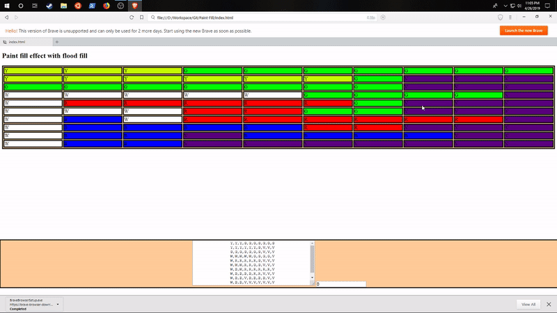

# Paint-Fill
Paint fill effect using flood fill algorithm 


# Quick-Start Guide

- [Installation](#installation)
- [Usage](#usage)

## Installation

**1. Clone this repo:**

```sh
git clone --depth 1 https://github.com/AndrewKralovec/Paint-Fill.git my-app
cd my-app
```


**2. Remove project git files:**

```sh
rm -rf .git && git init && npm init
```


**3. Install the dependencies:**

```sh
npm install
```

> Dependencies done installing!


**4. Build the entry js file:**

```sh
npm run build
```

> You're now setup

## Usage

The view is build in the `index.html` file in the root directory. The view consists of a table, to display the matrix, a form, to enter your desired matrix and an text
input to allow the user to choose a replacement color. When the page loads the script will paint the initial matrix data to the table. Once the table is loaded, the user 
can click on any table cell, and this will trigger the event to call the flood fill algorithm to change the target with the replacement color.


